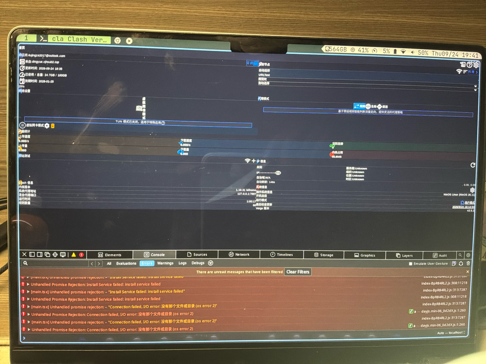

+++
date = '2026-09-24T22:10:33+08:00'
draft = false
title = 'Clash Verge GUI崩坏修复'
+++
如果遇到如图情况

解决办法：编辑~/.local/share/io.github.clash-verge-rev.clash-verge-rev/verge.yaml 关掉静默启动enable_silent_start，然后重启电脑
我的环境：nixos asahi-linux niri wayland
