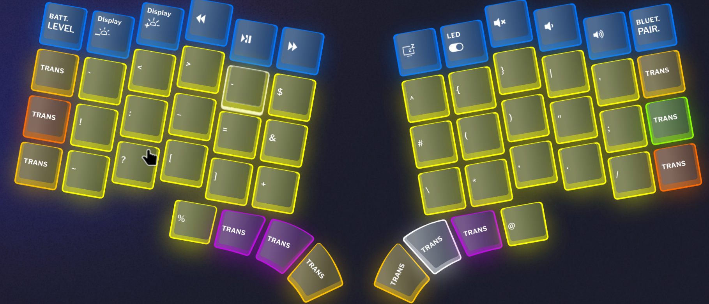
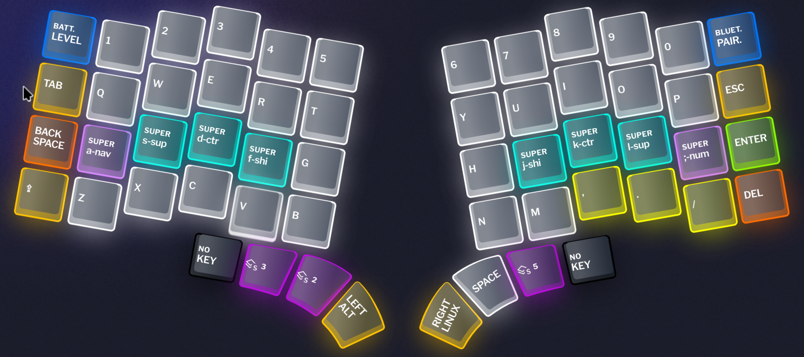
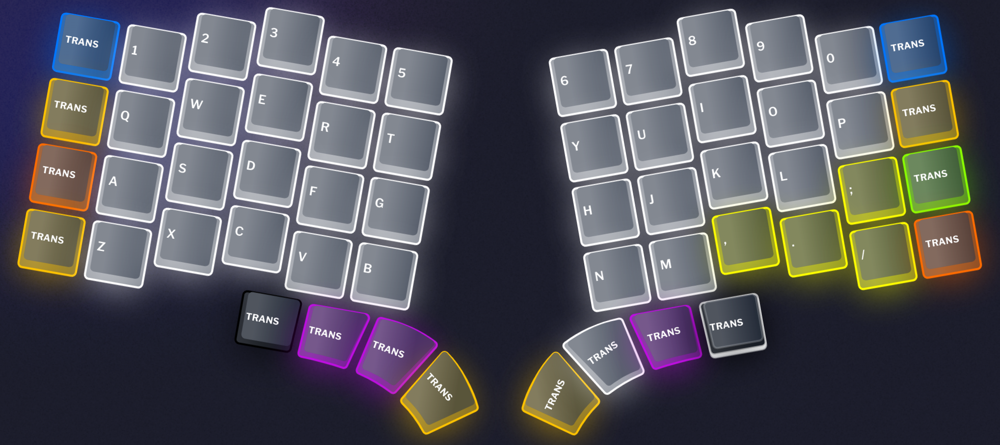
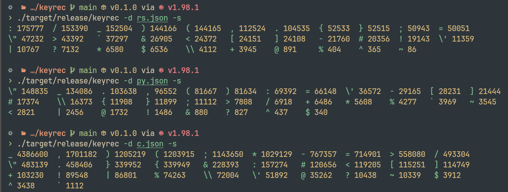
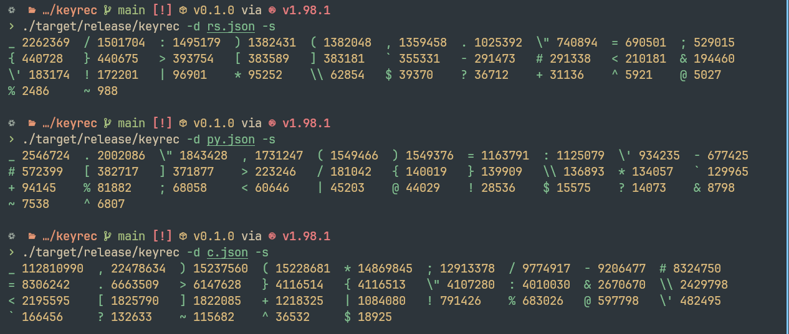
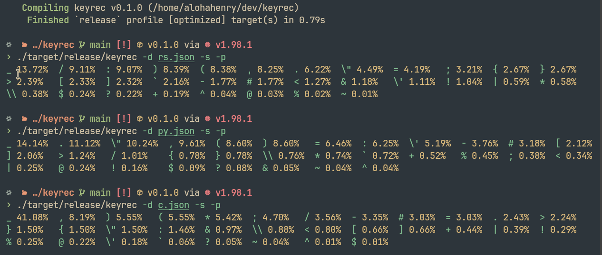

+++
date = '2026-09-24T11:08:14+08:00'
draft = false
title = '我的符号层设计'
+++
我在Pascal（见reference）的基础上以rust>py>c的优先级做了修改

并对.rs/.py/.c.h的符号使用做了统计

我的符号层(l2):

其他层:

符号统计:
用户目录:

全部:

## Reference
[Designing a Symbol Layer Pascal Getreuer, 2021-10-30](https://getreuer.info/posts/keyboards/symbol-layer/index.html)
